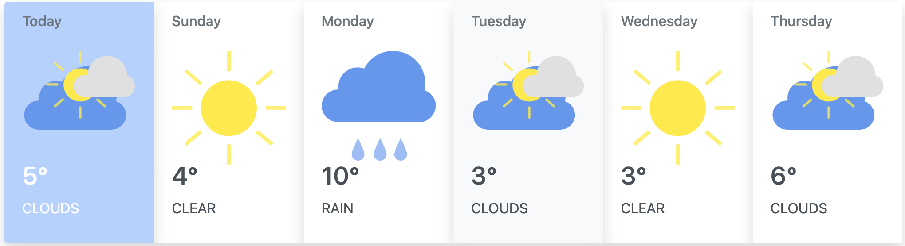

<!-- AUTOMATION BADGES -->

[](https://github.com/webceyhan/ng-weather-app/actions/workflows/github-code-scanning/codeql)

<!-- LOGO (OPTIONAL) -->


<!-- HEADER ///////////////////////////////////////////////////////////// -->

# Angular Weather Application

This is a simple weather application built on Angular Framework.
It uses `GeoCities API` to provide auto-suggestion for world city names.
After choosing a city, weather forecast information will be fetched from `OpeanWeatherMap API` to demonstrate the weather cards for given city.

<br>
<!-- REQUIREMENTS /////////////////////////////////////////////////////// -->

## Requirements

You need to install the [Node.js](https://nodejs.dev/)
and `npm` package manager first.

You also need to create an account on [OpenWeatherMap](https://openweathermap.org/) to obtain API key which is required to grab weather info.

> Recommended IDE:
> [VSCode](https://code.visualstudio.com/) + [Angular Essentials](https://marketplace.visualstudio.com/items?itemName=johnpapa.angular-essentials)

<br>
<!-- INSTALLATION //////////////////////////////////////////////////////// -->

## Installation

1. Clone the repository.
   ```sh
   git clone https://github.com/webceyhan/ng-weather-app.git
   ```
2. Get inside the cloned project folder.
   ```sh
   cd ng-weather-app
   ```
3. Install NPM packages.
   ```sh
   npm install
   ```
4. Rename `.env.sample` file to `.env` and put your API key in it.
   ```sh
   OPENWEATHER_API_KEY=
   ```

<br>
<!-- USAGE /////////////////////////////////////////////////////////////// -->

## Usage

You can use following commands to do various task with the project.

```sh
npm start               # run application
npm run serve           # start development server
npm run test            # run test suits
npm run build           # build for production
```

> Take a look at the other scripts in [`package.json`](./package.json)

<br>
<!-- DEVELOPMENT ///////////////////////////////////////////////////////// -->

## Development

Run the backend server first with `npm start` which is needed for API calls.

Then run `ng serve` for a dev server. Navigate to `http://localhost:4200`.

The app will automatically reload if you change any of the source files.

<br>
<!-- TESTING ///////////////////////////////////////////////////////////// -->

## Testing

Run `ng test` to execute the unit tests via [Karma](https://karma-runner.github.io).

Run `ng e2e` to execute the end-to-end tests via [Protractor](http://www.protractortest.org/).

<br>
<!-- BUILDING //////////////////////////////////////////////////////////// -->

## Building

Run `ng build` to build the project.
The build artifacts will be stored in the `dist/` directory.
Use the `--configuration production` flag for a production build.

<br>
<!-- DEPLOYMENT ////////////////////////////////////////////////////////// -->

## Deployment (Render)

Project is linked to [Render](https://render.com/) for deployment.

> It will automatically deploy the project to Render on every push.

> Do not forget to add `OPENWEATHER_API_KEY` environment variable.

<br>
<!-- REFERENCES ////////////////////////////////////////////////////////// -->

## References

- [Node.js](https://nodejs.dev/)
- [Angular](https://angular.io/)
- [Bootstrap](https://getbootstrap.com)
- [TypeScript](https://www.typescriptlang.org)
- [Express](https://expressjs.com/) (backend server)
  - [GeoCities API](http://geodb-free-service.wirefreethought.com/v1/geo/cities)
  - [OpeanWeatherMap API](https://api.openweathermap.org/data/2.5)
